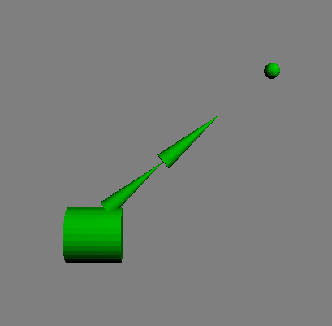
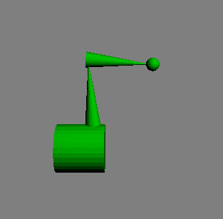

# Real-Time Animation Assignment 2 - Inverse Kinematics
The purpose of this assignment was to learn how inverse kinematics works in practice. The program was written in C++ using OpenGL libraries. The finished program demonstrates an implementation of 2-bone IK using an analytical solution. A torso with a 2 links is shown to follow a ball around the screen with the end of the 2nd link always pointing at the ball, for both reachable and unreachable positions. As well as this, an attempt at implementing 3-bone IK using CCD is demonstrated. 

2-bone IK, showing the end link always pointing towards the ball:

Link to video demonstrating the features listed above:
[CS7GV5 - Inverse Kinematics](https://youtu.be/vVoyleIeb7I)
